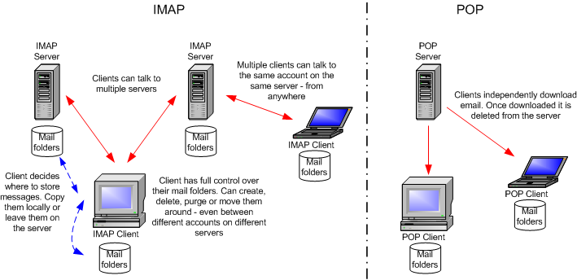

# IMAP(Internet Message Access Protocol) / POP3 (Post Office Protocol)
> IMAP: is a network protocol for the online management of emails on a remote server  
> Port: 143, 993

> POP3: only provides listing, retrieving, and deleting emails as functions at the email server  
> Port: 110, 995

### IMAP Commands
| Command | Description |
| ------  | ----------- |
| 1 LOGIN username password | User's login. |
| 1 LIST "" * | Lists all directories. |
| 1 CREATE "INBOX" | Creates a mailbox with a specified name. |
| 1 DELETE "INBOX" | Deletes a mailbox. |
| 1 RENAME "ToRead" "Important" | Renames a mailbox. |
| 1 LSUB "" * | Returns a subset of names from the set of names that the User has declared as being active or subscribed. |
| 1 SELECT INBOX | Selects a mailbox so that messages in the mailbox can be accessed. |
| 1 UNSELECT INBOX | Exits the selected mailbox. |
| 1 FETCH <ID> all | Retrieves data associated with a message in the mailbox. |
| 1 CLOSE | Removes all messages with the Deleted flag set. |
| 1 LOGOUT | Closes the connection with the IMAP server. |
 
### POP3 Commands 
| Command | Description |
| ------- | ----------- |
| USER username | Identifies the user. |
| PASS password | Authentication of the user using its password. |
| STAT | Requests the number of saved emails from the server. |
| LIST | Requests from the server the number and size of all emails. |
| RETR id | Requests the server to deliver the requested email by ID. |
| DELE id | Requests the server to delete the requested email by ID. |
| CAPA | Requests the server to display the server capabilities. |
| RSET | Requests the server to reset the transmitted information. |
| QUIT | Closes the connection with the POP3 server. |

### Cheatsheet
| Command | Description |
| ------- | ----------- |
| curl -k 'imaps://<FQDN/IP>' --user <user>:<password> | Log in to the IMAPS service using cURL. |
| openssl s_client -connect <FQDN/IP>:imaps | Connect to the IMAPS service. |
| openssl s_client -connect <FQDN/IP>:pop3s | Connect to the POP3s service. |